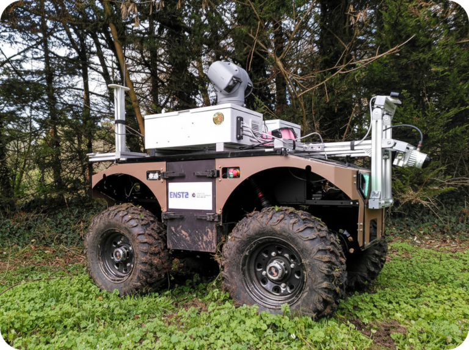
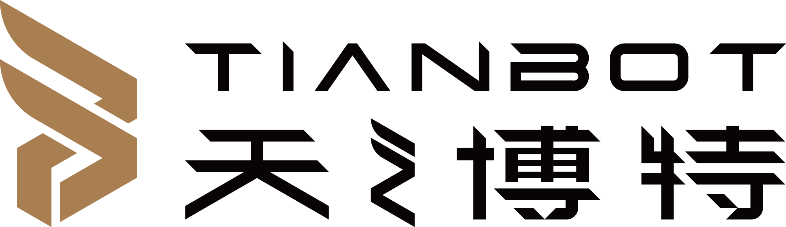

#### Perception, Learning, and Navigation

&nbsp;&nbsp;&nbsp;

This workshop will discuss core challenges and new solutions in **perception, learning and navigation** for autonomous robots operating over long terms in the wild, complex and unstructured environments.
With robotics applications in the wild broadening from environmental monitoring and agriculture to autonomous driving and disaster relief, the requirement for long-term robust, adaptive, and intelligent systems becomes essential.
This workshop will bring together researchers and practitioners to share new technologies in sensor processing, scene understanding, mapping, localization, and machine learning to address the unique demands of long-term operations in the wild, including varying terrain, adverse weather, dynamic lighting conditions, and seasonal changes.
Our goal is to foster collaboration and move toward new frontiers in robust multimodal perception, self-supervised learning, online/continual/lifelong learning, simulation-to-reality transfer, and explainable AI to enable safe, reliable and long-term autonomous robots in the wild.
This workshop will feature presentations, papers, and interactive discussion by leading experts, highlighting recent developments and future research directions for enhanced long-term performance of robotic systems in the wild.

## Venue

VIECON (formerly Messe Wien), Vienna, Austria.

## Call for Papers

The workshop will cover a range of topics, including but not limited to:
* Long-term autonomy, persistent mapping, and online/continual/lifelong learning in ever-changing environments.
* Robust perception in harsh and dynamic conditions in the wild.
* Sensor fusion for robust long-term state estimation and scene understanding.
* Self-supervised/unsupervised/weakly-supervised learning in LoWi.
* Terrain classification and traversability analysis in LoWi.
* Sim-to-real transfer and domain adaptation in LoWi.
* Foundational models and their applications in LoWi.
* Safety, long-term reliability, uncertainty quantification, and interpretability in LoWi.
* Novel sensors, long-term or multi-season datasets, and benchmarks in LoWi.
* Reinforcement learning for navigation and interaction in dynamic, unpredictable scenarios.
* Data generation, augmentation, and active learning for the wild.
* Applications with a clear focus on long-term perception, learning, and navigation challenges.

## Submission Guidelines

* We invite submissions in two tracks:
  - Full papers (4 to 8 pages): Eligible for Lightning Talks, Awards, and the Journal Special Issue.
  - Extended abstracts (up to 2 pages): Accepted abstracts will be presented in the Poster Session.
* All submissions must use the standard [IEEE RAS conference template](https://ras.papercept.net/conferences/support/tex.php) and present research relevant to the workshop's themes.
* Submitted papers must not be under review or have been published in another archival venue.
* A double-blind peer-review process will be implemented. Papers will be evaluated based on their novelty, technical soundness, clarity, and relevance to the workshop.
* Accepted papers will be hosted on the workshop website but will not appear in the official IEEE Xplore proceedings, allowing for future submission to journals or major conferences.
* All accepted papers will be invited for either a spotlight oral or a poster presentation at the workshop.
* A selected number of high-quality **full papers** will be invited to submit an extended version of their work to a Special Issue of the [IEEE Transactions on Field Robotics (T-FR)](https://www.ieee-ras.org/publications/t-fr). 
* Papers should be submitted through the CMT portal: [**https://cmt3.research.microsoft.com/LoWi2026**](https://cmt3.research.microsoft.com/LoWi2026)

## Awards and Travel Grants

Thanks to the generous support of our sponsors, we are pleased to announce the following awards and opportunities:
* We will present a **Best Student Presentation Award** and a **Best Presentation Award** to recognize outstanding contributions to the workshop. Winners will receive a certificate and a cash prize. The selection will be based on the quality of the paper and the presentation delivered during the workshop.
* We are committed to fostering diversity and inclusion within the robotics community. A limited number of **Travel Grants** are available to support student authors, with priority given to applicants from underrepresented regions or groups.
  - **Eligibility:** Student authors of accepted papers.
  - **Application:** Details on how to apply will be sent to authors upon paper acceptance.

## Important Dates

* Paper submission deadline: ~~March 20, 2026~~ **Extended: April 17, 2026 11:59 p.m. (Anywhere on Earth)**
* Paper notification of acceptance:  ~~April 22, 2026~~ **May 01, 2026**
* Workshop date: **June 1, 2026**

## Schedule

| **Time** | **Speaker** | **Topic / Title** |
| -------- | ----------- | ----------------- |
| 08:50 - 09:00 | Organizers               | Welcome and Workshop Overview                |
| 09:00 - 09:30 | Timothy Barfoot          | Everywhere and Everywhen: Progress on Long-Term Localization with Radar |
| 09:30 - 10:00 | Xieyuanli Chen           | Learning Robust and Generalizable Features for Long-term Localization |
| 10:00 - 10:20 | [5 papers](#foundation)  | Lightning Talks (3 min/pers)                 |
| 10:20 - 10:30 | TBD                      | Startup Presentation                         |
| 10:30 - 11:00 | [12 papers](#foundation) | Coffee Break & Poster Session A (Setup)      |
| 11:00 - 11:30 | Ayoung Kim               | Long-Term LiDAR Localization in the Wild: From Foundation Models to Ultra-Lightweight Features |
| 11:30 - 12:00 | Marija Popović           | Learning Robust Robot Perception in Unknown Environments |
| 12:00 - 12:10 | TBD                      | Startup Presentation                         |
| 12:10 - 14:00 | -                        | Lunch Break & Poster Session A (Continued)   |
| 14:00 - 14:30 | Teresa Vidal Calleja     | Multi-robot Mapping in Maritime Environments |
| 14:30 - 15:00 | Kazunori Ohno            | Tough Physical AI for Task Automation in Harsh Environments |
| 15:00 - 15:20 | [5 papers](#deployment)  | Lightning Talks (3 min/pers)                 |
| 15:20 - 15:30 | ATEC (sponsor)           | [Competition Promotion](sponsors/ATEC2026_poster.jpg) |
| 15:30 - 16:30 | [12 papers](#deployment) | Coffee Break & Poster Session B              |
| 16:30 - 17:00 | All speakers             | Interactive Panel Discussion                 |
| 17:00 - 17:30 | Organizers               | Best Presentation Awards and Closing Remarks |

## Lightning Talks and Poster Sessions Details

> **Note to presenters:** All Lightning Talk papers are also required to present a physical poster during their assigned slot.

<b>📂 Click to expand Session A (10:30-11:00 & 12:10-14:00)</b>

 

<table style="width:100%; text-align:left;">
  <thead>
    <tr>
      <th>ID</th>
      <th>Presentation</th>
      <th>Paper Title</th>
    </tr>
  </thead>
  <tbody>
    <tr>
      <td>P01</td>
      <td>Lightning</td>
      <td>When to Map? Adaptive Switching Between Localization and SLAM in Multi-Session Systems</td>
    </tr>
    <tr>
      <td>P02</td>
      <td>Lightning</td>
      <td>Frequency-Preserved Logit Distillation for Long-term Robot Perception</td>
    </tr>
    <tr>
      <td>P03</td>
      <td>Lightning</td>
      <td>Continual Online Backward-Compatible Learning for LiDAR Place Recognition in Adverse Weather</td>
    </tr>
    <tr>
      <td>P04</td>
      <td>Lightning</td>
      <td>Deep Multi-Agent Reinforcement Learning for Multi-Robot Social Navigation in Constrained Environments</td>
    </tr>
    <tr>
      <td>P05</td>
      <td>Lightning</td>
      <td>Edge Radar Material Classification Under Geometry Shifts</td>
    </tr>
    <tr>
      <td>P06</td>
      <td>Poster Only</td>
      <td>In-context Adaptation of Place Recognition through Self-supervised Learning from Video</td>
    </tr>
    <tr>
      <td>P07</td>
      <td>Poster Only</td>
      <td>Toward Embedded Vision-Language Perception for Long-Term Autonomous Robots via Training-Free Token Pruning</td>
    </tr>
    <tr>
      <td>P08</td>
      <td>Poster Only</td>
      <td>GPU-Accelerated Semantic Embedded SLAM</td>
    </tr>
    <tr>
      <td>P09</td>
      <td>Poster Only</td>
      <td>ROS 2 Implementation of Appearance-based Visual Teach and Repeat Navigation</td>
    </tr>
    <tr>
      <td>P10</td>
      <td>Poster Only</td>
      <td>Energy-Aware NECO for Single-Pass Pixel-wise Out-of-Distribution Detection in Semantic Segmentation</td>
    </tr>
    <tr>
      <td>P11</td>
      <td>Poster Only</td>
      <td>COMPASS: Learning Global Spatial Context for Long-Range Robot Navigation</td>
    </tr>
    <tr>
      <td>P12</td>
      <td>Poster Only</td>
      <td>Voxels: A Lightweight Simulation for Mobile Robotics</td>
    </tr>
  </tbody>
</table>

<b>📂 Click to expand Session B (15:30-16:30)</b>

 

<table style="width:100%; text-align:left;">
  <thead>
    <tr>
      <th>ID</th>
      <th>Presentation</th>
      <th>Paper Title</th>
    </tr>
  </thead>
  <tbody>
    <tr>
      <td>P13</td>
      <td>Lightning</td>
      <td>Overcoming Nature: Perception for Autonomous Navigation in Dense Vegetation</td>
    </tr>
    <tr>
      <td>P14</td>
      <td>Lightning</td>
      <td>Adaptive Gaussian Process–Based Sampling for Energy-Efficient Aquatic Sensing with Autonomous Surface Vessels</td>
    </tr>
    <tr>
      <td>P15</td>
      <td>Lightning</td>
      <td>Disturbance-Aware Underwater Visual-Inertial Odometry via Learned Dynamics and External Force Estimation</td>
    </tr>
    <tr>
      <td>P16</td>
      <td>Lightning</td>
      <td>VERTIFORMER: A Data-Efficient Multi-Task Transformer on Vertically Challenging Terrain</td>
    </tr>
    <tr>
      <td>P17</td>
      <td>Lightning</td>
      <td>Helhest: An Affordable and Resilient R&D Platform for Long-Term Autonomous Navigation in the Wild</td>
    </tr>
    <tr>
      <td>P18</td>
      <td>Poster Only</td>
      <td>Towards 3D Karst Underwater Scene Reconstruction from Rotating Sonar Data</td>
    </tr>
    <tr>
      <td>P19</td>
      <td>Poster Only</td>
      <td>An Open-Source LiDAR and Monocular Off-Road Autonomous Navigation Stack</td>
    </tr>
    <tr>
      <td>P20</td>
      <td>Poster Only</td>
      <td>Building a Robust, Autonomous Pest-Control Vehicle for Real-World Agricultural Deployment</td>
    </tr>
    <tr>
      <td>P21</td>
      <td>Poster Only</td>
      <td>State Corrected Predictive Preference Learning for Multimodal Robot Navigation on Uneven Terrain</td>
    </tr>
    <tr>
      <td>P22</td>
      <td>Poster Only</td>
      <td>Vision-Language Modeling for Natural-Language Wheel Loader Assistance in Unstructured Construction Environments</td>
    </tr>
    <tr>
      <td>P23</td>
      <td>Poster Only</td>
      <td>Multi-view 6D Pose Estimation of the Aerial Docking Device for Long-Term Drone Operation in Dynamic Environments</td>
    </tr>
    <tr>
      <td>P24</td>
      <td>Poster Only</td>
      <td>Extending Operational Mission Lifetimes of Free-Flying Space Robots via Hypernetwork-Based Multi-Task GNC Controller</td>
    </tr>
  </tbody>
</table>

 

## Speakers

\
[Timothy Barfoot](http://asrl.utias.utoronto.ca/~tdb/)\
University of Toronto, Canada

\
[Xieyuanli Chen](https://chen-xieyuanli.github.io/)\
National University of Defense Technology, China

\
[Ayoung Kim](https://rpm.snu.ac.kr/)\
Seoul National University, South Korea

\
[Marija Popović](https://research.tudelft.nl/en/persons/m-popovic)\
Delft University of Technology, Netherlands

\
[Teresa Vidal Calleja](https://profiles.uts.edu.au/Teresa.VidalCalleja)\
University of Technology Sydney, Australia

\
[Kazunori Ohno](https://www.r-info.tohoku.ac.jp/en/1dbca76142c072cb4a4403b1c317eb26.html)\
Tohoku University, Japan

~~**Title: Seven Years in the Wild: Lessons from Agricultural Robots at Scale**~~\
Update: Due to unforeseen circumstances, Jaime Pulido Fentanes will be unable to join us.\
\
[Jaime Pulido Fentanes](https://scholar.google.es/citations?user=rTntw-wAAAAJ)\
Saga Robotics, Norway

## Organizers

\
[Zhi Yan](https://yzrobot.github.io/)\
ENSTA - Institut Polytechnique de Paris, France

\
[François Goulette](https://www.ensta-paris.fr/fr/francois-goulette)\
ENSTA - Institut Polytechnique de Paris, France

\
[Alexandre Chapoutot](https://www.ensta-paris.fr/fr/alexandre-chapoutot)\
ENSTA - Institut Polytechnique de Paris, France

\
[David Filliat](https://perso.ensta-paris.fr/~filliat/en/)\
AMIAD, France

\
[Andreas Nüchter](https://www.informatik.uni-wuerzburg.de/robotics/team/nuechter/)\
University of Würzburg, Germany\
Hi! PARIS International Visiting Chair, France

\
[Tao Yang](https://teacher.nwpu.edu.cn/yangtao2020.html)\
Northwestern Polytechnical University, China

\
[Martyna Poreba](https://fr.linkedin.com/in/martynaporeba)\
Université Paris-Saclay, CEA, List, France

\
[Fatemeh Rekabi Bana](https://www.durham.ac.uk/staff/fatemeh-rekabi-bana/)\
Durham University, UK

\
[Jindriska Deckerova](https://deckejin.github.io/)\
Czech Technical University in Prague, Czech Republic

\
[Tomas Krajnik](https://chronorobotics.fel.cvut.cz/)\
Czech Technical University in Prague, Czech Republic

## Sponsors

&nbsp;&nbsp;&nbsp;
&nbsp;&nbsp;&nbsp;
&nbsp;&nbsp;&nbsp;

## Contact

If you have any questions, please contact us at [lowiworkshop@gmail.com](mailto:lowiworkshop@gmail.com).

---

&nbsp;&nbsp;&nbsp;
&nbsp;&nbsp;&nbsp;
&nbsp;&nbsp;&nbsp;
&nbsp;&nbsp;&nbsp;
&nbsp;&nbsp;&nbsp;
&nbsp;&nbsp;&nbsp;
&nbsp;&nbsp;&nbsp;

---

The Microsoft CMT service was used for managing the peer-reviewing process for this conference. This service was provided for free by Microsoft and they bore all expenses, including costs for Azure cloud services as well as for software development and support.
